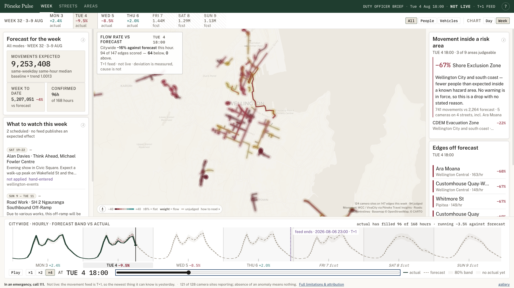
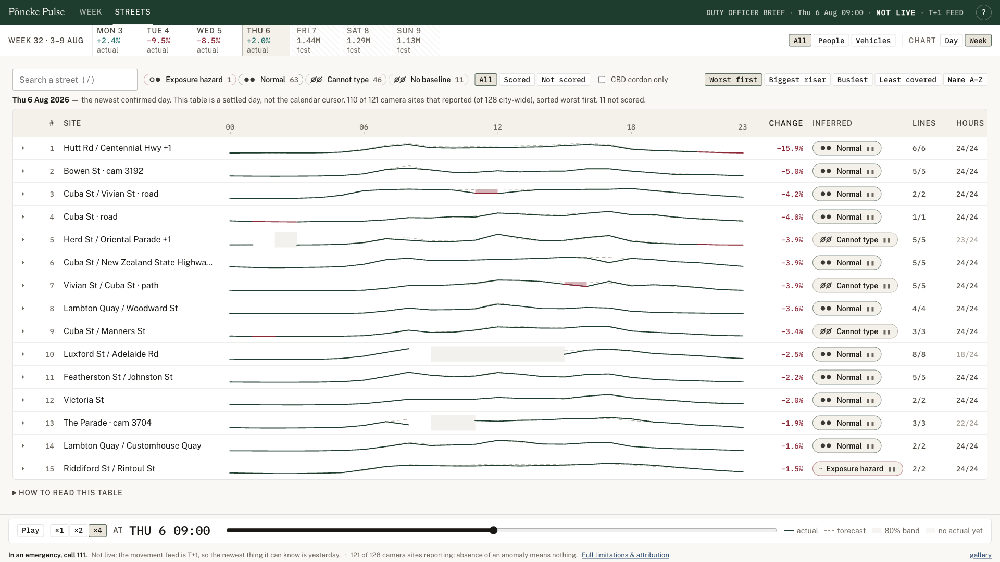
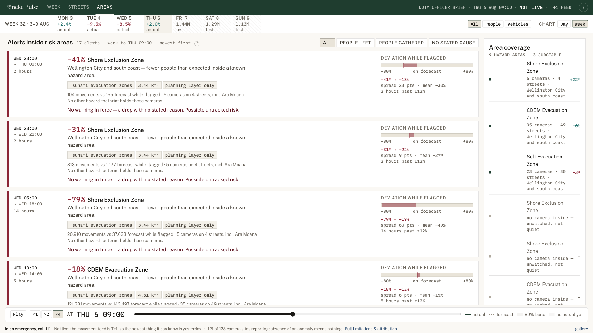

<div align="center">

# Pōneke Pulse

**A baseline for how Wellington moves, and an alarm for when it stops moving that way.**

Built for Wellington City Council Emergency Management at Impact Lab Wellington,
problem 05 — *detect unusual changes in movement around the city*.

[**Try the demo →**](https://claudecommunity-nz.github.io/impact.lab.wlg.team-8.2026-08-08/)
&nbsp;·&nbsp;
[The problem, as briefed](docs/impact-lab.md)

<sub>A static snapshot you can click through — the real system runs continuously against the feed.</sub>

<br>


</div>

---

<h2 align="center">What it does</h2>

Wellington has 128 traffic and pedestrian camera sites. On their own they tell you
how many people passed a corner. They don't tell you whether that number is *normal*.

Pōneke Pulse builds the "normal" first — a per-street, per-hour, per-mode baseline
from the trailing same-weekday, same-hour median — and then scores the actual counts
against it. What reaches the screen is not traffic volume. It is **deviation**: where
the city is behaving differently from how it behaves on an ordinary equivalent day,
and by how much.

The prototype then does the part that makes a deviation actionable. A number that is
30% down on a back street is noise. The same drop inside a tsunami evacuation zone,
during a warning, is a question somebody needs to answer this hour.

<h2 align="center">Who it's for</h2>

**Duty watch managers at WCC Emergency Management** — the person on shift who needs to
know where an event is affecting people before the individual reports start arriving.

The questions it is built to answer are the ones they already ask:

- Is an event drawing more people into the city than we planned for?
- Has a weather warning actually reduced the number of people out, or not?
- **Are people heeding an evacuation?** Is the exclusion zone emptying — or filling?
- Where has access been lost, and is that a closure we knew about?

<h2 align="center">How it works</h2>

```
movement feed          baseline                deviation              so what
────────────          ──────────              ───────────            ─────────
128 camera sites  →   same-weekday       →    actual vs         →   deviation inside
147 road edges        same-hour median        forecast band          a risk area
                      trailing 84 days        per edge, per hour     = something to act on
                            ↑
                    causation feeds
                    (events, closures, warnings)
                    shown as FYI — never folded
                    into the forecast
```

The deviation is measured. **The cause is not inferred.** That distinction is enforced
throughout the interface, because a tool that quietly guessed *why* movement changed
would be worse than no tool at all in the one situation it exists for.

<h2 align="center">The views</h2>

### Week — the duty officer's brief

The whole week at a glance: forecast band against actual, hour by hour, with the map
showing which streets are off-forecast right now. Scrub the timeline and the map,
the ranking and the risk read all move together.

<div align="center">
  
  <br>
  <sub>Tue 4 Aug 18:00 — citywide <b>−16% against forecast</b>, 64 of 94 scored edges below.</sub>
</div>

### Streets — every edge, ranked

The same hour as a table. Every camera site with its 24-hour trace against baseline,
sorted worst-first, filterable by inferred state. This is where a manager goes from
"something is off" to "it is these eleven streets".

<div align="center">
  
  <br>
  <sub>110 of 121 reporting sites, worst first. <b>11 not scored</b> — and it says so.</sub>
</div>

### Areas — the "so what"

Deviation only matters where it intersects something that matters. This view crosses
movement with hazard geography — tsunami evacuation zones, exclusion zones, emergency
routes — and states the consequence in a sentence.

*More people than expected inside a known hazard area* is a fundamentally different
morning from *fewer people than expected, with no warning in force*. Both are alerts
here, filterable by what actually happened: **people left**, **people gathered**, or
**no stated cause** — the last being the one that most deserves a phone call.

<div align="center">
  
  <br>
  <sub>Every alert carries its own footprint, duration and camera count — and the coverage
  rail names the zones with <b>no camera inside</b>, because unwatched is not the same as quiet.</sub>
</div>

<h2 align="center">Modular by design</h2>

Baselines go wrong for knowable reasons. A concert, a road closure, a cruise ship, a
red wind warning — each one makes "normal" the wrong yardstick for a few hours.

Pōneke Pulse takes these in as **causation feeds**: small adapters that publish an
expected effect and surface it beside the deviation as context.

| Adapter | Source | State |
|---|---|---|
| `nzta-road-events` | NZTA road closures and works | connected |
| `metservice-warnings` | MetService severe weather warnings | connected |
| `wellington-events` | Major events in the city | hand-entered |
| `centreport-cruise` | Cruise ship arrivals | stub |

Adding a feed is adding an adapter — the interface picks it up without changing.

**None of them moves the forecast.** They are shown so a human can explain a deviation,
not so the model can explain it away. The framework to turn a feed into an adjusted
forecast is built and deliberately unused: doing that well needs validation this
prototype has not earned, and a silently adjusted baseline is the failure mode that
would cost the most trust.

<h2 align="center">What it deliberately does not do</h2>

These constraints are surfaced in the interface, not buried here.

- **This deployment is a static snapshot.** What you can click above is a frozen bundle
  so anyone can play with it — no server, no credentials. The system itself is built to
  run continuously against the feed; nothing in the pipeline assumes a fixed date.
- **The data is T+1, and that is the real ceiling.** Even running live, the movement feed
  publishes to yesterday, so this is a next-morning and after-action tool rather than a
  live detector. The header says so on every screen. **In an emergency, call 111.**
- **Coverage is sparse.** 128 camera sites across a whole city, many blind to one mode
  or the other. *Absence of an anomaly means nothing* — it usually means nothing was
  watching. The map shows where it can and cannot see.
- **It refuses rather than guesses.** Days with partial ingest are marked *refused*, not
  scored. Of the 15 biggest citywide drops in 756 days, 12 were public holidays or
  broken ingest — the guard is not a feature, it is the credibility.
- **Hazard-planning data, not operational emergency information.** GIS layers are
  planning material. One MetService warning is hand-entered from public reporting and
  labelled as such, because MetService publishes no archive.

<h2 align="center">Run it</h2>

```bash
just poc-dev      # the app, hot-reloading          → localhost:5199
just poc-check    # typecheck, lint, build, e2e     — the gate before a demo
just poc-data     # rebuild artefacts from raw data — needs TRAVEL_INSIGHTS_KEY
```

**A fresh clone runs the prototype without any data pull.** The app reads only the
derived artefacts in `team8/poc_1/web/public/data`, which are committed. Source data
(`data/raw/`, ~66 MB) is gitignored — it belongs to its publishers, not to us.

```
team8/poc_1/pipeline/   Python — baseline, edges, diagnosis, feeds
team8/poc_1/web/        React + deck.gl — the interface
team8/fetch_data/       pull scripts, inventory, profiler
```

Every push to `main` builds and deploys to GitHub Pages. CI verifies that every data
file the app fetches is present and committed before it bundles — the pipeline writes
into `public/data`, so a file that never gets committed works locally forever and 404s
from a clean checkout.

<h2 align="center">Data</h2>

**Movement** — Pōneke Travel Insights (WCC / VivaCity) over Opendatasoft:
`countline-mobility-hourly-summary`, 5.39M rows, 410 countlines.

**Hazard geography** — the [WCC Emergency GIS catalogue](https://github.com/claudecommunity-nz/wcc-emergency-gis-data):
tsunami evacuation zones, emergency routes, community hubs, street-event closures.

**Future context data** — the [future context data directions](docs/future-context-data.md)
record the wider set of weather, disruption, lifelines, transport, planned-event,
hazard, equity and community-signal sources considered for a fuller operational picture.

**Basemap** — © OpenStreetMap, © CARTO.

Each dataset belongs to its publisher — WCC, Greater Wellington, WREMO, NZTA,
MetService. Licence terms vary per dataset; check before republishing anything derived,
and credit the publisher.

---

<div align="center">

Code is [Apache 2.0](LICENSE) — free to use and modify, attribution required.
Keep the [NOTICE](NOTICE) file with it. The data is not covered by either.

<sub>Impact Lab Wellington · 8 August 2026 · Wellington City Council Emergency Management × Claude Code Community NZ</sub>

</div>
